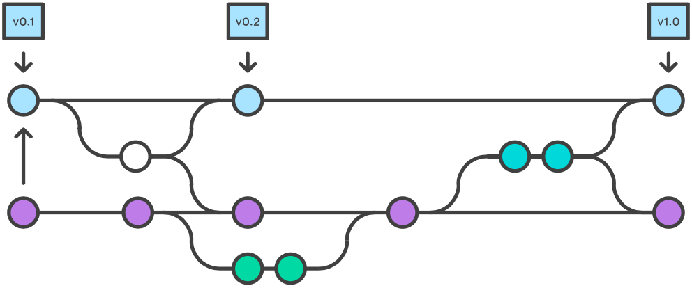

# Git

It's not a mild insult.

### What is Git then?

It's a **distributed version control system**. :confused: 

That is.. a system that lets you save **changes** to a file or set of files **over time**, so that you can recall specific versions later.

That is, a powerful way of **backing up** your projects and **collaborating** efficiently with other people.

<!-- The *distributed* bit means that you can use Git offline. --> 

### Why do we need Git?

Because you only realise it's wise to **back up** your project when one of the following happens:

* Your computer breaks, gets stolen, is eaten by the cat...
* You accidentally delete a file. Permanently. For ever.
* You save a document with the same name of another document. Bye bye previous document.
* You run out of `cmd-Z`. End of history. 

#### Sure, backing up is important, but can we not use Dropbox for that? 

Tools like Dropbox automatically back up files as you save them. Every new save overwrites the previous. 

This system could be ok if you work on your own, but it breaks apart if you want/need to work on a project with someone else (which is more often than you think).

The question is: *how* do you back up? Specifically

1. Do you back up only the latest version of your files/project? Or do you keep separate versions?
* How much do you save? Only the changed files or the complete project?
* How do you name versions? How about `project-ABC-final-v2-signed-off-13-07-2023-the-finalest-really`?
* How do you know what exactly is different in these versions?

Git allows you to 

* **revert** files back to a previous state
* revert an entire project back to a previous state
* **compare** changes over time
* see **who** last modified something that might be causing a problem and **when**
* **recover** files if someone (you?) screws things up
* **merge** all changes to a project into a **shared repository**
* solve **conflicts** between file versions
* **branch** out a project to try something without affecting other versions

#### It's all about collaboration

Using Git, many people can work on the same documents at the same time, without overwriting any part of them.

Git is more than a back-up tool. It's a **collaboration** enabler.

<!-- In fact, being a back-up tool is more of a side-effect than the primary goal of Git (or any other version-control system). -->

<!-- Ever found yourself shouting through the room that you are currently working on a certain file and so nobody else should touch it in the meanwhile? -->

<!-- With Git, everybody on the team can work absolutely freely, on any file at any time. Git will allow you to *merge* all the changes into a shared *repository* and solve any *conflicts* for you. There's no question where the latest version of a file or the whole project is: it's on Git. -->

<!-- With Git, there is only **one project**. There's only one version on your disk that you're currently working on. Everything else, all the past versions and variations (aka *branches*), are neatly packed up inside Git. When you need it, you can request any version at any time and you'll have a snapshot of the complete project right at hand. -->

<!-- Being able to restore older versions of a file (or even the whole project) effectively means one thing: **you can't mess up**! -->

<!-- Git is a command-line tool that you - and any other developers on your team - use to save frequent snapshots of your projects. At any given point, it offers the flexibility to roll back changes to previous states, with only a single command. -->

### How does Git work?

There are two ways of working with Git:

1. Using a *Command Line Interface* (CLI). You can learn more about the Git CLI with this [interactive tutorial](https://try.github.io).  

	  
	<!---->
* Using a *Graphic User Interface* (GUI) application.

Using a CLI is very cool, in a Matrix-like way. However it's easier to have a visual interface sometimes. Most of the times. For that, you can use the [SourceTree](http://www.sourcetreeapp.com) app (it's free).

For the rest of this guide, we'll take the GUI approach and use SourceTree.

<!-- 1. Sign up to [GitHub](https://github.com), [BitBucket](https://bitbucket.org) or [GitLab](https://about.gitlab.com)
2. Download [SourceTree](http://www.sourcetreeapp.com), it's free!
3. If you're on a Mac, clean up the global `.gitignore` (add `.DS_Store` so that files that are generated by Mac OSX will not be pushed to the *mothership*)
4. You're ready to use Git to keep your projects tidy, backed-up and collaborative!  -->

## The Git workflow

### 1. Edit

First, you edit your files on your computer (aka *Working Copy*).

Any changes you make to the Working Copy will appear on Source Tree.

* New files will appear with a question mark (?) next to them.
* Changed files will appear with an ellipsis (...) next to them.

### 2. Commit

When you’re ready to save a copy of the current state of the project, you *stage* changes and *commit* them to the project history.

Whenever you commit a bunch of changes to your files, you will need to add a **commit message**. It can be anything, however it helps if you write something meaningful and descriptive of the changes you've made.

> It's good practice to **make lots of small commits** rather than one massive push at the end of the day.

### 3. Push

After you've commited some changes, a number icon will pop up over the *Push button*. 

This means that your commits are ready to be uploaded to the mothership (aka *origin repository*).

The name of our remote is *origin* and the default local branch name is *master*. 

**Push = upload**

If there are no conflicts between your files and those on the mothership, **you're done!**

### Pull

**Pull = download**

If other people are working at the same project, before you can upload your changes to the mothership (aka *origin repository*), you may need to **pull** the latest version from the mothership into your working copy. 

If there's a number over the *Pull button* you should pull those *remote* changes into your *Working Copy* (and possibly sort out conflicts before you can push your changes).

<!-- 

## Branching

Ever been at a point in a project, when you want to experiment with an idea that may or may not make it into the finished application? While it's true that you can always revert the commit if things don't go according to plan, it's a smarter idea, for a variety of reasons, to instead leverage branching.

remember the part in Back to the Future 2, after Marty and Doc return to 1985 from the future, but find that everything is different? Upon meeting at Doc's, now destroyed lab, Doc draws a diagram, describing how, at some point, "the timeline skewed into this tangent, creating an alternate 1985." This is just like branching!

http://think-like-a-git.net/sections/experimenting-with-git/branches-as-savepoints.html
...creating a branch is like saving your game before you battle the boss.

 -->

<!-- 
## Pull requests

encouraging developers to fork a project's repository and then use that as their own centralized repository. From there they can send "pull requests" to the main project with their changes and then the project maintainers can review them before deciding whether to include them in their project or not. -->

#### TODO

- [ ] Explain how to create a repo, or fork one
- [ ] Pull requests
- [ ] Check out http://dougbelshaw.com/blog/2015/01/04/github-pages
- [ ] Check out [GitHub for beginners](http://readwrite.com/2013/09/30/understanding-github-a-journey-for-beginners-part-1)
- [ ] Check out [This like a Git](think-like-a-git.net), especially the graph theory bit (a Git commit is a node in a graph, and nodes can point to other nodes that came before them.)

<!-- ### Pull request

Pull requests let you tell others about changes you've pushed to a Git repository. Once a pull request is sent, other people can review your changes, discuss potential modifications, and even push follow-up commits if necessary.

We'll [learn more about pull requests](https://help.github.com/articles/using-pull-requests/) later on in the unit. -->
