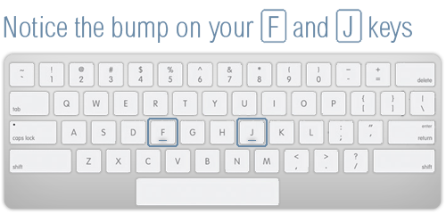

Spend the summer experimenting with [code](#code) and [design](#design), and actively seek [inspiration](#inspiration).

If you have any suggestions, `fork` this repository, add your bits and then send us a `pull request` :cactus:

We :heart_eyes: feedback!

> Unless otherwise stated, all our recommendations below are **free** (as in free beer).

## Code

To practice your Web-making skills and learn some new tricks, [*Codecademy*](http://www.codecademy.com) is a decent place to start. In particular, check out these tracks:

*   [HTML + CSS](http://www.codecademy.com/tracks/web)
*   [Make a website](http://www.codecademy.com/skills/make-a-website/)
*   [jQuery](http://www.codecademy.com/en/tracks/jquery)
*   [Make an interactive website](http://www.codecademy.com/skills/make-an-interactive-website/)
*   [JavaScript](http://www.codecademy.com/tracks/javascript)
*   [Web Projects](http://www.codecademy.com/tracks/projects)
*   [YouTube API](http://www.codecademy.com/tracks/youtube)
*   [Command Line](http://www.codecademy.com/learn/learn-the-command-line)

We also recommend:

* [Dash](https://dash.generalassemb.ly/): do everything but project 4 *Build a CSS robot*, which is rather gimmicky
* [Playto](https://learn.playto.io/): complete all three tutorials
* [CSS Diner](http://flukeout.github.io/#), a game to master CSS *selectors*
* [Codewars](http://www.codewars.com/?language=javascript): reach at least *Novice* level on the JavaScript challenges
* [Stack Overflow](http://stackoverflow.com/): sign up and start asking questions
* [GitHub](https://github.com/): if you haven't already, sign up, create your first *repository* and start using it. Read and contribute to our [how-to-**git** guide](how-to-git.md)

### Learn to touch-type

* [Typing Club](http://www.typingclub.com/) course
* [Touch Type](http://games.djordjeungar.com/touchtype) game

### Read

<!--We like [Eloquent JavaScript](http://eloquentjavascript.net/). It includes a number of embedded code snippets that you can edit and run as you read. You may also want to look at [the annotated version](https://watchandcode.com/courses/eloquent-javascript-the-annotated-version).-->

The [building blocks of programming](https://github.com/matteomenapace/apps-from-scratch/tree/master/sessions/02#programming-building-blocks) is a 9-minutes guide that explains you *when*, *why* and *how* to use the universal building blocks of every programming language (examples in JavaScript). 

If 9 minutes is too much for you, try [JavaScript for cats](http://jsforcats.com/).

By the way, [what is code?](http://www.bloomberg.com/graphics/2015-paul-ford-what-is-code/)

### Watch

<!--* [Computer science: past, present, and future](http://youtu.be/5Tk09c0FQ3M), a talk by Ed Lazowska-->
  
* [The future doesn't have to be incremental](https://youtu.be/gTAghAJcO1o?t=2m41s), a talk by Alan Kay
* [The future of programming](https://vimeo.com/71278954), a talk by Bret Victor
* [Inventing on principle](http://vimeo.com/36579366), another talk by Bret Victor

## Design

We like [Hack Design](https://hackdesign.org/lessons), in particular:

* [Graphic design principles](https://hackdesign.org/lessons#graphic-design-principles)
* [Typography](https://hackdesign.org/lessons#typography)
* [User experience](https://hackdesign.org/lessons#user-experience)
* [User interface](https://hackdesign.org/lessons#user-interface)

<!---->

We also recommend:

* [UX myths](http://uxmyths.com/)
* [What makes them click](http://www.blog.theteamw.com/)
* [Pttrns](http://pttrns.com/)
* [User interface design patterns](http://ui-patterns.com/)
* [PatternTap](http://zurb.com/patterntap/)
* [User flow patters](http://userflowpatterns.com/)
* [Brief history of UX](http://blog.invisionapp.com/a-brief-history-of-user-experience)
* [The Web ahead](http://thewebahead.net/)
* [Interviewing humans](https://medium.com/research-things/interviewing-humans-fa198f809c40)
* [Invisible design](https://blog.intercom.io/invisible-design/) 
* [13 ways designers screw up presentations](https://medium.com/@monteiro/13-ways-designers-screw-up-client-presentations-51aaee11e28c)
* [Making things people want](https://blog.intercom.io/making-things-people-want/)
* [The unexotic underclass](http://miter.mit.edu/the-unexotic-underclass)
* [The Web's grain](http://www.frankchimero.com/writing/the-webs-grain/)

## Inspiration

:notebook: Keep a **sketchbook** / blog / whatever works for you, but **don't let your ideas slip away**. :bulb: 

<!--Inspiration can be anywhere, so keep looking out for it.-->

### Briefs

To put your ideas into practice, give yourself a brief and work on it.

If you're stuck for ideas, here are a few briefs that you can tackle:

1. After intelligent life has been discovered on another planet, NASA gets in touch with you. They want to give the aliens access to the WWW so that they can learn about life on Earth. Your task is to **design an interface** to establish first contact with the *alien users*.

2. The year is 2035 and the Tate-Google Gallery has commissioned you to create a **Web-based retrospective exhibition** looking at *the defining moments of life in the second decade of the 21st century*.

3. It is the winter of 2014 and Scotland has declared independence from the UK. The government fears Wales and Northern Ireland will follow suit and has asked you to **redesign the Union flag** to represent England as a single sovereign state. 

4. We’re **catching a train**, and we have only a short time to buy a ticket at the station. Do we join the massive queue at the ticket office or try the ticket machine? We tackle the machine. Instant confusion: when is *Off Peak*, *Anytime*? Now there’s a queue behind you..   
  
	Design a sequence of interfaces that are informative, legible and easier to navigate when buying a train ticket.

